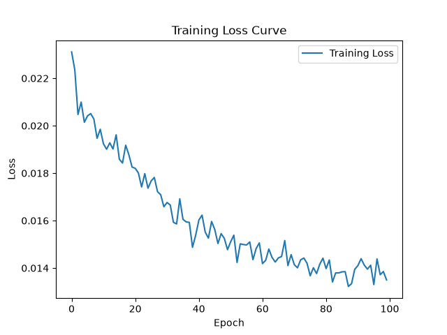

# Titanic - Machine Learning from Disaster

**我深知这个题解是不完善的，但我不清楚四天时间够不够修改出一份令我满意的题解。我的想法是先提交一个小样来请学长帮助“纠偏”，看我在目前的部分有没有方向上或者是理解上的的错误，然后在这几天尽力优化题解达到相对满意的水准。**

AI Coding 声明： `train.py` 中 `for epoch in range(epochs)` 那几行代码是 AI 生成的，但是我能够解释每一行代码具体的作用是什么。后面还出现了类似的代码，这些代码是我依葫芦画瓢改的。

所有的报错信息如果没有自己搜到解法均是使用 AI 后解决的。其他使用到 AI 但没有生成代码的部分均会在题解标注。

## 数据处理

### 清洗和填充数据

首先利用 pandas 读取数据并打印出 `data.info()` 得知，年龄、登船地、客舱号都有缺失数据。年龄是数字，而登船地、船舱号是文本，它们遵循不同的填充方法。

对于年龄，因为缺失的数目不多，可以直接使用平均值填充年龄。

登船港口只差了 3 个，我们可以直接用众数填充。

*在这里我的代码是 `data["Embarked"] = data["Embarked"].fillna(data["Embarked"].mode())`，但是打印后发现缺失的数据没有被正确地填充，询问了 AI 并且查证了 pandas 文档后得知，这是因为 mode() 的结果不是一个固定的值，而是一个列表，所以应当改成取其第一项。*

船舱数据缺得太多了，但是众数填充也不太合适，先用一个前面都没出现过的 Z 填充占位吧。

### 转换数据格式

机器不能处理文字，只能处理数值。在这里，我们把一些常见的分类变量变成数值格式。

对于性别，因为只有两种，所以只需要用 `map()` 方法将其重新映射为 0 和 1。

对于登船地，因为有多个分类，同时这三个分类没有优劣之分（不适合采用直接编码，会引入大小之间的不必要关系），因此采用 One-Hot 编码。

*One-Hot 编码在 pandas 中的使用，需要先用 `pd.get_dummies()` 得到虚拟列，然后再把虚拟列的数据加入原有的数据中，最后 `drop` 掉原有的数据。*

*改：后面发现实际上只需要对原数据赋值 `pd.get_dummies(data,columns)` 即可。*

在分析到名字时，我们会发现其中每一个名字中间都有一个头衔。头衔是逗号后句号前中间的字符串，采用 `split` 分隔，`strip` 除去空白字符即可。

使用 `print(set(data["Title"]))` 将其提取并去重后，可以得到每一个头衔的信息如下。

```
{'Mrs', 'Mme', 'Sir', 'Col', 'Jonkheer', 'Rev', 'Ms', 'Major', 'the Countess', 'Lady', 'Master', 'Miss', 'Capt', 'Mlle', 'Mr', 'Don', 'Dr'}
```

[Deepseek 对这些头衔的分析](https://chat.deepseek.com/share/191ec1npo04adq1eui)

由于 Age 等数据已经得出，事实上用这些头衔确定年龄必要不大；则根据这个头衔主要可以得到：

1. 是否是权贵 (VIP)
2. （女性）是否结婚（Married）

在后续将这些数据处理之后，Title 这一行可以直接删去。

Ticket 由于不知道怎么处理，直接放到后面清除。

### 构造数据

构造如下数据：

- 是否权贵 VIP，如果登船人的头衔不同往常（已经考虑过其他语言中和英语相同的头衔，这些不会被列入权贵），则其 VIP 为 1，否则为 0
- 登船家庭成员数目 Family，为同辈人数 + 不同辈人数 + 1（自己）
- 船舱 Cabin，由于具体住哪里很多缺失，但是船舱的分类是有价值的，可以通过首字读出其分类
  *对于读取首字这种功能不需要再去 `def` 新函数，只需采用 lambda 即可*

### 清除数据

由于 Name、Title、SibSp、Parch 的数据我们已经处理完，将其 `drop` 即可。同时也清除 Ticket。

清除数据之后，将其写到本地，准备下一步操作。

## 数据分析

``````
Survived       1.000000
Sex            0.543351
Married        0.516700
Fare           0.257307
Cabin_B        0.175095
Embarked_C     0.168240
Cabin_D        0.150716
Cabin_E        0.145321
Cabin_C        0.114652
VIP            0.060185
Cabin_F        0.057935
Cabin_A        0.022287
Family         0.016639
Cabin_G        0.016040
Embarked_Q     0.003650
PassengerId   -0.005007
Cabin_T       -0.026456
Age           -0.064910
Embarked_S    -0.149683
Cabin_Z       -0.316912
Pclass        -0.338481
``````

根据处理好的数据打印与是否生还的相关性，结果如上。可知性别、是否结婚、船舱等级等都比较相关。遗憾的是，构造的 Family VIP 等数据相关性并不高。为了方便，我们选择除了 PassengerId 和 Survived 作为 feature，而 Survived 作为 label。

## 模型构建

### 准备 Dataset 和 DataLoader

新建一个 TitanicDataset 类，定义以下三个方法：

- `__init__` 读取我们之前一步预处理好的数据。需在这个方法中确定特征值 X 和标签值 Y。利用`torch.tensor(data, dtype=)`可以把 `pandas.DataFrame` 变成张量。`data` 可以做如此筛选：`df.iloc[row,col].values`
- `__len__` 读取数据的长度（虽然代码上是 feature，但是这是一个二维张量 (样本量，特征数)，调用 `len` 是读的第一个样本量）
- `__getitem__` 根据序列返回特定项的特征值 X 和标签值 Y

利用 Dataset 类的初始化导入整个数据集，然后根据 4/1 的原则划分数据集，划分数据集直接使用了 `random_split()`，没有分层抽样（如果能够引入 sklearn 那么实现分层抽样会很方便，但是这里先暂时不引入了）

初始化训练集和测试集的 Loader，以 32 为一批，调用方法是`DataLoader(Dataset, batch, shuffle)`，训练的时候可以打乱顺序，但是测试的时候就不需要了。

### 构建模型

新建一个 MLP 类，定义以下两个方法：

- `__init__(self, input_dim)` 设定整个模型的组成，它接受一个输入特征数的参数，也就是 `features.shape[1]`（这里也解释了上面二维张量的部分）。在这个方法中，我们设置 `self.net` 为一个序列，这个序列决定了整个模型长什么样子
- `forward(self, x)` 设定了前向传播，也就是把 x 代入到函数当中，直接写 `self.net(x)` 即可

模型的结构如下（询问了 [AI](https://chat.deepseek.com/share/ijw4gjefthvu3j8y2q)）：

| 顺序 | 层      | 维度    | 说明                     |
| :--- | :------ | :------ | :----------------------- |
| 1    | Linear  | 19 → 32 | 输入 19 维，隐藏层 32 维 |
| 2    | ReLU    | 32 → 32 | 激活                     |
| 3    | Dropout | p=0.2   | 训练时随机置零           |
| 4    | Linear  | 32 → 16 | 第二隐藏层               |
| 5    | ReLU    | 16 → 16 | 激活                     |
| 6    | Dropout | p=0.2   | 训练时随机置零           |
| 7    | Linear  | 16 → 2  | 输出 2 类                |


### 初始化模型、设定 Loss 函数、优化器

初始化 MLP，代入原有数据的特征量；设定 Loss 函数为交叉熵，优化器为 Adam。交叉熵是二分类标准的 Loss 函数，Adam 优化器可以自适应学习率，减少人工操作的难度。

## 训练模型

在每一个 Epoch 中执行以下几个步骤：

1. `model.train()` 把模型调整到训练状态，在这个状态下 Dropout 等过程才会起效；
2. `optimizer.zero_grad()` 清除原有的梯度；
3. `outputs = model(features)` 前向传播；
4. `loss = criterion(outputs,labels)` 根据观测值和预测值计算 Loss；
5. `loss.backward()` 反向传播，更新梯度；
6. `optimizer.step()` 读取各个梯度信息，并根据优化算法更新参数，完成一次迭代。

## 评估模型

在一个 Epoch 中执行以下步骤（实际上，也可以在模型训练结束之后进行）：

1. `model.eval()` 把模型调整到评估状态；
2. `with torch.no_grad():` 关闭梯度计算；
3. `model(features).argmax(dim=1)` 前向传播，这里 `argmax` 是取二分类分数的最大值；

## 保存和复用模型

采用 `torch.save(model.state_dict(), "path")` 可以保存数据，后续可以再恢复。之后可以用相同的方法先初始化模型，但是不进行训练，而是采用 `model.load_state_dict(torch.load("path"))` 就可以直接调用原有的 pth。

# 结果和分析

在项目根目录运行 main.py 会先按照题目给定的数据进行预处理，然后给出需要执行的操作。依次按照顺序从上到下运行可以得到：

```
(.venv) PS D:\Coding\lingrui\ml\titanic> python .\src\main.py
请稍后，正在预处理数据……
读取到泰坦尼克号数据集，共 891 条乘客数据
填充空白年龄数据……
填充空白船舱数据……
填充空白登船地数据……
清除重复数据……
缺失数据和重复数据处理完毕
开始特征工程……
处理分类变量……
构造数据……
清除不必要的数据……
整理顺序……
数据预处理完成！
预处理完成的数据已经保存到本地！
===
请选择需要执行的操作
1. 从零开始训练并保存模型
2. 加载保存的模型并对整个数据集做预测
3. 预测新数据
E. 退出
===
1
从零开始训练，从本地读取处理后数据……
准备开始训练，共 100 轮
第 1 轮训练 Loss 为 0.0231，测试准确率为 0.6760
第 2 轮训练 Loss 为 0.0224，测试准确率为 0.6704
第 3 轮训练 Loss 为 0.0205，测试准确率为 0.6704
第 4 轮训练 Loss 为 0.0210，测试准确率为 0.6816
第 5 轮训练 Loss 为 0.0201，测试准确率为 0.6816
第 6 轮训练 Loss 为 0.0204，测试准确率为 0.6872
第 7 轮训练 Loss 为 0.0205，测试准确率为 0.6816
第 8 轮训练 Loss 为 0.0203，测试准确率为 0.6704
第 9 轮训练 Loss 为 0.0195，测试准确率为 0.6760
第 10 轮训练 Loss 为 0.0198，测试准确率为 0.6760
第 11 轮训练 Loss 为 0.0192，测试准确率为 0.6704
第 12 轮训练 Loss 为 0.0190，测试准确率为 0.6760
第 13 轮训练 Loss 为 0.0193，测试准确率为 0.6816
第 14 轮训练 Loss 为 0.0190，测试准确率为 0.6872
第 15 轮训练 Loss 为 0.0196，测试准确率为 0.6872
第 16 轮训练 Loss 为 0.0186，测试准确率为 0.6816
第 17 轮训练 Loss 为 0.0184，测试准确率为 0.7039
第 18 轮训练 Loss 为 0.0192，测试准确率为 0.6592
第 19 轮训练 Loss 为 0.0188，测试准确率为 0.7095
第 20 轮训练 Loss 为 0.0183，测试准确率为 0.7151
第 21 轮训练 Loss 为 0.0182，测试准确率为 0.7151
第 22 轮训练 Loss 为 0.0180，测试准确率为 0.7374
第 23 轮训练 Loss 为 0.0174，测试准确率为 0.7542
第 24 轮训练 Loss 为 0.0180，测试准确率为 0.7654
第 25 轮训练 Loss 为 0.0174，测试准确率为 0.7542
第 26 轮训练 Loss 为 0.0177，测试准确率为 0.7654
第 27 轮训练 Loss 为 0.0178，测试准确率为 0.7654
第 28 轮训练 Loss 为 0.0172，测试准确率为 0.7765
第 29 轮训练 Loss 为 0.0171，测试准确率为 0.7821
第 30 轮训练 Loss 为 0.0166，测试准确率为 0.8045
第 31 轮训练 Loss 为 0.0168，测试准确率为 0.8324
第 32 轮训练 Loss 为 0.0167，测试准确率为 0.8436
第 33 轮训练 Loss 为 0.0159，测试准确率为 0.8212
第 34 轮训练 Loss 为 0.0159，测试准确率为 0.8436
第 35 轮训练 Loss 为 0.0169，测试准确率为 0.7989
第 36 轮训练 Loss 为 0.0161，测试准确率为 0.8547
第 37 轮训练 Loss 为 0.0159，测试准确率为 0.8212
第 38 轮训练 Loss 为 0.0159，测试准确率为 0.8436
第 39 轮训练 Loss 为 0.0149，测试准确率为 0.8268
第 40 轮训练 Loss 为 0.0154，测试准确率为 0.8324
第 41 轮训练 Loss 为 0.0160，测试准确率为 0.8324
第 42 轮训练 Loss 为 0.0162，测试准确率为 0.8380
第 43 轮训练 Loss 为 0.0155，测试准确率为 0.8547
第 44 轮训练 Loss 为 0.0153，测试准确率为 0.8492
第 45 轮训练 Loss 为 0.0160，测试准确率为 0.8436
第 46 轮训练 Loss 为 0.0156，测试准确率为 0.8436
第 47 轮训练 Loss 为 0.0150，测试准确率为 0.8492
第 48 轮训练 Loss 为 0.0155，测试准确率为 0.8547
第 49 轮训练 Loss 为 0.0153，测试准确率为 0.8492
第 50 轮训练 Loss 为 0.0148，测试准确率为 0.8547
第 51 轮训练 Loss 为 0.0151，测试准确率为 0.8492
第 52 轮训练 Loss 为 0.0154，测试准确率为 0.8268
第 53 轮训练 Loss 为 0.0142，测试准确率为 0.8268
第 54 轮训练 Loss 为 0.0150，测试准确率为 0.8212
第 55 轮训练 Loss 为 0.0150，测试准确率为 0.8436
第 56 轮训练 Loss 为 0.0150，测试准确率为 0.8156
第 57 轮训练 Loss 为 0.0151，测试准确率为 0.8324
第 58 轮训练 Loss 为 0.0144，测试准确率为 0.8212
第 59 轮训练 Loss 为 0.0148，测试准确率为 0.8268
第 60 轮训练 Loss 为 0.0151，测试准确率为 0.8324
第 61 轮训练 Loss 为 0.0142，测试准确率为 0.8436
第 62 轮训练 Loss 为 0.0143，测试准确率为 0.8436
第 63 轮训练 Loss 为 0.0148，测试准确率为 0.8659
第 64 轮训练 Loss 为 0.0144，测试准确率为 0.8156
第 65 轮训练 Loss 为 0.0143，测试准确率为 0.8380
第 66 轮训练 Loss 为 0.0144，测试准确率为 0.8156
第 67 轮训练 Loss 为 0.0145，测试准确率为 0.8101
第 68 轮训练 Loss 为 0.0152，测试准确率为 0.8324
第 69 轮训练 Loss 为 0.0141，测试准确率为 0.8212
第 70 轮训练 Loss 为 0.0146，测试准确率为 0.8268
第 71 轮训练 Loss 为 0.0141，测试准确率为 0.8156
第 72 轮训练 Loss 为 0.0140，测试准确率为 0.8380
第 73 轮训练 Loss 为 0.0143，测试准确率为 0.8212
第 74 轮训练 Loss 为 0.0144，测试准确率为 0.8436
第 75 轮训练 Loss 为 0.0142，测试准确率为 0.8212
第 76 轮训练 Loss 为 0.0137，测试准确率为 0.8212
第 77 轮训练 Loss 为 0.0140，测试准确率为 0.8212
第 78 轮训练 Loss 为 0.0138，测试准确率为 0.8436
第 79 轮训练 Loss 为 0.0142，测试准确率为 0.8156
第 80 轮训练 Loss 为 0.0144，测试准确率为 0.8156
第 81 轮训练 Loss 为 0.0140，测试准确率为 0.8156
第 82 轮训练 Loss 为 0.0143，测试准确率为 0.8101
第 83 轮训练 Loss 为 0.0134，测试准确率为 0.8268
第 84 轮训练 Loss 为 0.0138，测试准确率为 0.8324
第 85 轮训练 Loss 为 0.0138，测试准确率为 0.8268
第 86 轮训练 Loss 为 0.0138，测试准确率为 0.8212
第 87 轮训练 Loss 为 0.0138，测试准确率为 0.8268
第 88 轮训练 Loss 为 0.0132，测试准确率为 0.8268
第 89 轮训练 Loss 为 0.0133，测试准确率为 0.8101
第 90 轮训练 Loss 为 0.0139，测试准确率为 0.8212
第 91 轮训练 Loss 为 0.0141，测试准确率为 0.8268
第 92 轮训练 Loss 为 0.0144，测试准确率为 0.8212
第 93 轮训练 Loss 为 0.0141，测试准确率为 0.8380
第 94 轮训练 Loss 为 0.0140，测试准确率为 0.8324
第 95 轮训练 Loss 为 0.0141，测试准确率为 0.8436
第 96 轮训练 Loss 为 0.0133，测试准确率为 0.8212
第 97 轮训练 Loss 为 0.0144，测试准确率为 0.8324
第 98 轮训练 Loss 为 0.0137，测试准确率为 0.8101
第 99 轮训练 Loss 为 0.0139，测试准确率为 0.8324
第 100 轮训练 Loss 为 0.0135，测试准确率为 0.8212
保存了 Loss-Epoch 图像！
保存了 Acc-Epoch 图像！
保存了模型权重！
===
请选择需要执行的操作
1. 从零开始训练并保存模型
2. 加载保存的模型并对整个数据集做预测
3. 预测新数据
E. 退出
===
2
加载本地已有的模型权重……
模型在给定数据上的准确率为 0.8260
===
请选择需要执行的操作
1. 从零开始训练并保存模型
2. 加载保存的模型并对整个数据集做预测
3. 预测新数据
E. 退出
===
3
请按照 train.csv 中的格式输入一行数据，例如
1,0,3,"Braund, Mr. Owen Harris",male,22,1,0,A/5 21171,7.25,,S
308,1,1,"Penasco y Castellana, Mrs. Victor de Satode (Maria Josefa Perez de Soto y Vallejo)",female,17,1,0,PC 17758,108.9,C65,C
读取到泰坦尼克号数据集，共 1 条乘客数据
填充空白年龄数据……
填充空白船舱数据……
填充空白登船地数据……
清除重复数据……
缺失数据和重复数据处理完毕
开始特征工程……
处理分类变量……
构造数据……
清除不必要的数据……
整理顺序……
数据预处理完成！
预处理完成的数据已经保存到本地！
预测其存活，实际存活，预测正确。
===
请选择需要执行的操作
1. 从零开始训练并保存模型
2. 加载保存的模型并对整个数据集做预测
3. 预测新数据
E. 退出
===
E
正在退出……
```




可见 Loss 随 Epoch 波动下降，并在 100 轮后到达一个较低的值。同时，Training Acc 和 Test Acc 均随 Epoch 同步上升，也是波动的，然而 Training Acc 在后续均低于 Test Acc。

最终训练出的模型在全局的准确率为 0.8260%。

# 遇到的一些问题以及可行的改进点

1. 不是分层抽样，或许会导致模型习得的数据不均匀。
2. 没有经过归一化或者标准化，但目前的 Acc 达到了 80%，即使经过了这样的操作，其准确度也上升不了多少吧？
3. 最先的架构是 data.py 做数据处理，train.py 做训练，main.py 写一个小的 CLI 调用它们俩，但是发现如果后面要引入预测新的数据就不太好了，应该把我们准备好的模型、Dataset 这些零散的东西抽出来专门放到一个管理数据结构的文件中。
4. 众数填充失败，询问 AI 得知 pandas 计算出的众数是一个序列。
5. 训练模型的时候发现 Training Acc 甚至低于 Test Acc，[查证 AI](https://chat.deepseek.com/share/3vb99iazckbohkx5ng) 后发现是因为我的模型有 Dropout，本身准确率就比较低，而测试的时候所有神经元都没失效。
6. 模型的结构肯定是能再优化的，不过从什么方向入手优化比较好？（我的想法是因为输入只有 19 维，中间隐藏层的维度数目是不是不应该那么多？或者是需不需要再加入几层？减小 Dropout 的 p 值让它先把准确度变高？）
7. 发现在新数据预测的时候 One-Hot 编码会出大问题，因为数据量太少了有些根本没覆盖进去。参考了 [AI](https://chat.deepseek.com/share/uiiym5evorxwtegsr9)。
8. 为什么有些时候模型的训练很快？有些时候又很慢？是否存在某种缓存机制？
9. 目前保存的模型权重是最后一轮的数据，而不是在训练过程中取得的最好数据，后续可以改进。
10. 为什么 Training Acc 在一开始的时候比 Test Acc 低了这么多？（好像是因为我在 Test 的时候已经用`optimizer.step()`迭代了一次，所以这个 Test 的准确率就会上升）
11. 为什么模型的权重是个二进制文件？既然所有参数都能够量化，为什么不直接弄一个文本文件来把所有的权重存下来？或者说因为这是个张量文本存着不方便？

**我深知这个题解是不完善的，但我不清楚四天时间够不够修改出一份令我满意的题解。我的想法是先提交一个小样来请学长帮助“纠偏”，看我在目前的部分有没有方向上或者是理解上的的错误，然后在这几天尽力优化题解达到相对满意的水准。**